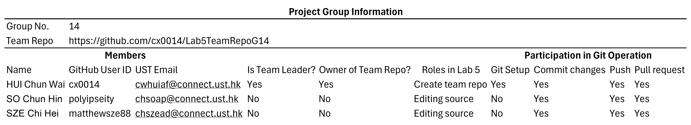
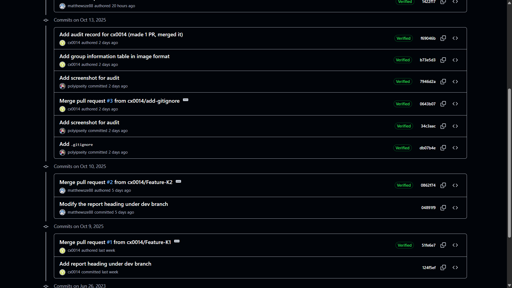

# Lab5TeamRepoG14

## audit

1. [new branch](#new-branch)
2. [commit](#commit)
3. [push](#push)
4. [pull request](#pull-request)
5. [merge](#merge)

### new branch

### commit

### push

### pull request

### merge

